

  

  # CreativeWriter Community

A powerful, AI-enhanced creative writing application that helps authors craft compelling stories with intelligent assistance for plot development, character creation, narrative structure, and rich media integration.

CreativeWriter is available in two editions:

- **[Hosted](https://creativewriter.dev)** — Fully managed, just sign up and write
- **[Self-Hosted](https://github.com/MarcoDroll/creativewriter-selfhosted)** — Deploy with Docker, source-available for personal use, full control over your data

> **This repository is the community hub** for bug reports, feature requests, and discussions — covering both editions. It does not contain application source code.

---

## Why the Redesign

CreativeWriter was originally built as a **PouchDB (client) + CouchDB (server)** application with offline-first sync. While this architecture worked, it had significant limitations:

- **Complex conflict resolution** — PouchDB/CouchDB sync required manual handling of document conflicts, especially with concurrent edits across devices
- **No row-level security** — CouchDB's per-database security model couldn't enforce fine-grained access control
- **Manual infrastructure** — Self-hosting required Docker containers, nginx reverse proxies, and manual CouchDB administration
- **No real-time cross-device sync** — Changes only synced on reconnect, not in real time
- **Fragile media handling** — Binary attachments in CouchDB were cumbersome and bloated replication

The **new architecture** uses **Supabase** (PostgreSQL + Auth + Storage + Realtime), which provides:

- Proper **row-level security** (RLS) on every table
- **Managed infrastructure** with zero ops overhead
- **Real-time sync** across all devices and tabs via Supabase Realtime
- **Cloudflare edge deployment** for fast global access
- **Supabase Storage** for reliable media handling

This resulted in two editions:

| Edition | Description | Link |
|---------|-------------|------|
| **Hosted** | Fully managed at creativewriter.dev — just sign up and write | [creativewriter.dev](https://creativewriter.dev) |
| **Self-Hosted** | Docker deployment, source-available for personal use, full control | [creativewriter-selfhosted](https://github.com/MarcoDroll/creativewriter-selfhosted) |

Both editions run on the new Supabase stack. The old PouchDB/CouchDB code is preserved in the [`archive/pouchdb-couchdb`](https://github.com/MarcoDroll/creativewriter-public/tree/archive/pouchdb-couchdb) branch for reference.

---

## Pricing & Self-Hosting

CreativeWriter is funded by subscriptions — you pay for the tool, not marked-up AI tokens. There are two tiers, **Basic** and **Premium**, each with a 7-day free trial. Live prices are shown at [creativewriter.dev](https://creativewriter.dev).

**Self-hosting? You don't need the Premium tier.** The premium features — AI Rewrite, Character Chat, and Portrait Generation — run entirely on your own API keys and infrastructure, so the cheaper **Basic** plan is enough to unlock them on your own instance. Any paid subscription generates a **license key** (Settings → Premium → Generate License Key) that grants full premium on a self-hosted deployment for a year. The Premium tier only adds *Included AI* (a managed DeepSeek + image budget) and managed hosting — both hosted-only, and neither needed when you bring your own keys.

Your hosted account is only for billing and generating the key; your stories live on your own instance and don't transfer to or from the hosted app. See the [self-hosted edition](https://github.com/MarcoDroll/creativewriter-selfhosted) for setup.

---

## Screenshots

### Story Structure & Organization
*Navigate your story with a hierarchical sidebar, visual outline, and rich text editing with embedded images.*

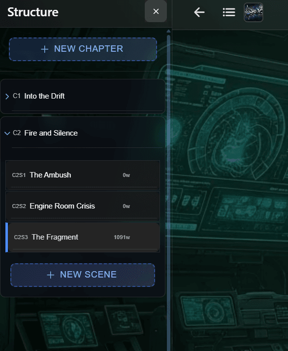

*Collapsible sidebar showing your full story hierarchy — acts, chapters, scenes, and beats.*

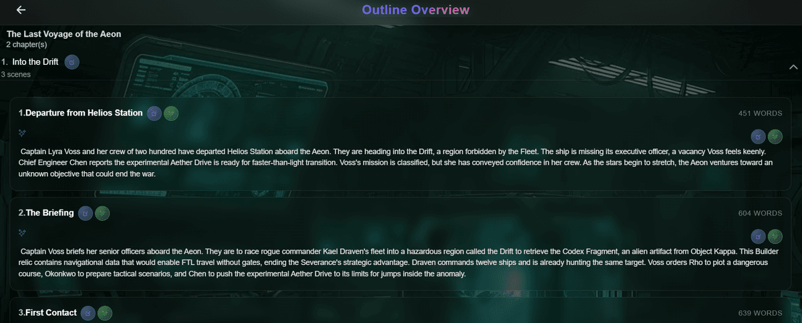

*Bird's-eye outline view of your entire narrative structure.*

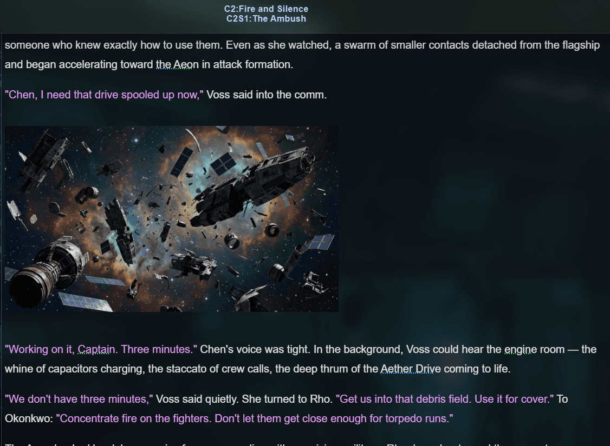

*ProseMirror editor with images embedded directly in your story text.*

---

### Beat Writing & AI Generation
*Write at the beat level — provide input, generate with AI, and revise until it's right.*

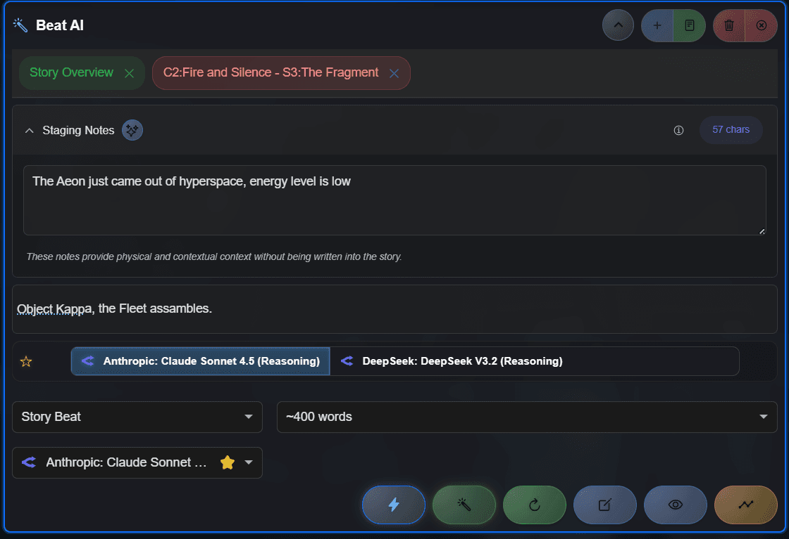

*Write a brief beat description to guide AI generation.*

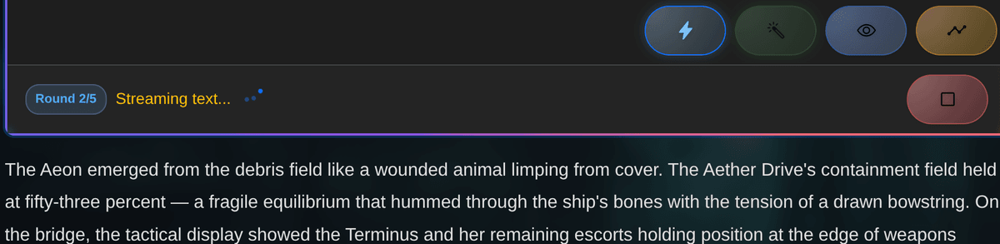

*Agentic generation reads your outline, codex, and prior scenes to write contextually aware prose.*

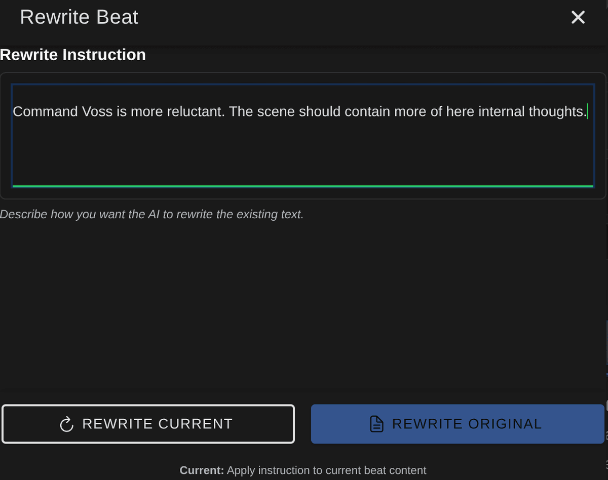

*Rewrite with different instructions or restore previous versions from beat history.*

---

### AI Chat & Research
*Chat with your scenes, talk to your characters, and run deep research — all AI-powered.*

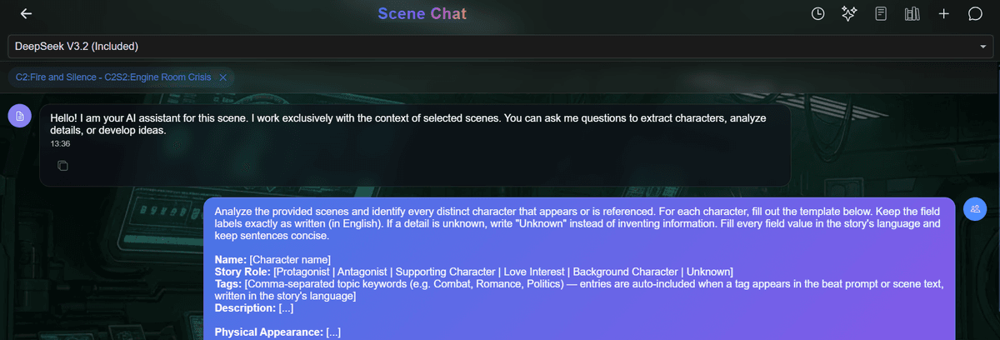

*Ask questions about your scene — the AI uses your full story context to answer.*

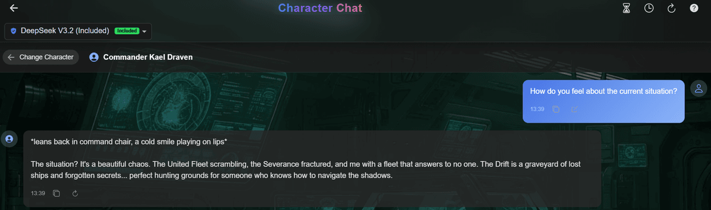

*Talk to your characters directly. The AI uses codex entries to stay in character.*

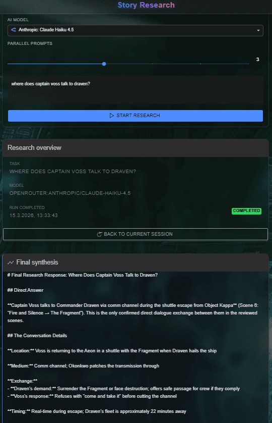

*Deep research mode for historical, scientific, or cultural details relevant to your story.*

---

### Codex & World-Building
*Build a knowledge base for your story's universe — characters, locations, factions, and more.*

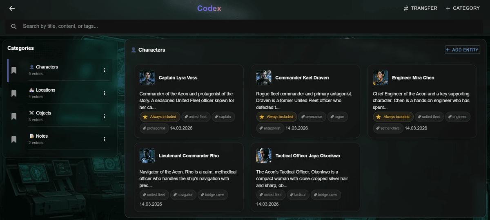

*All your world-building entries at a glance — searchable and organized by type.*

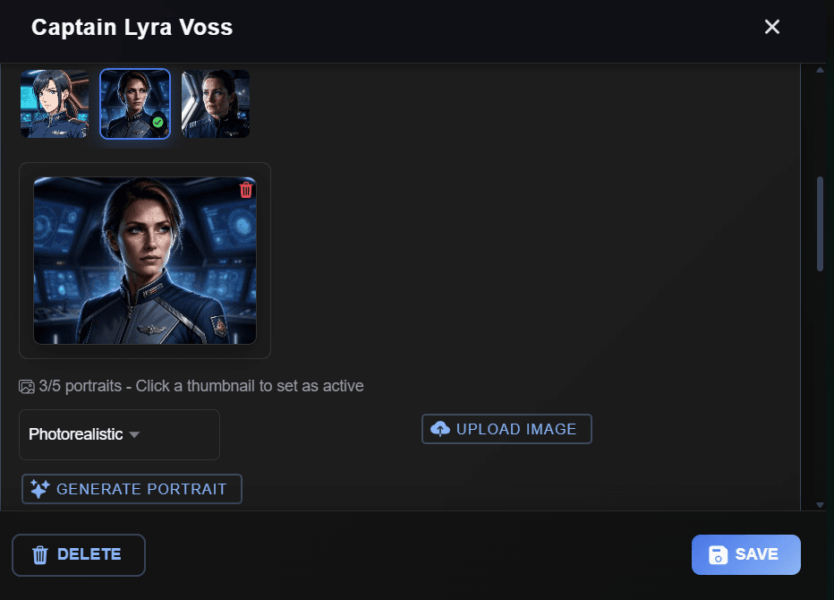

*Generate character portraits directly from codex descriptions.*

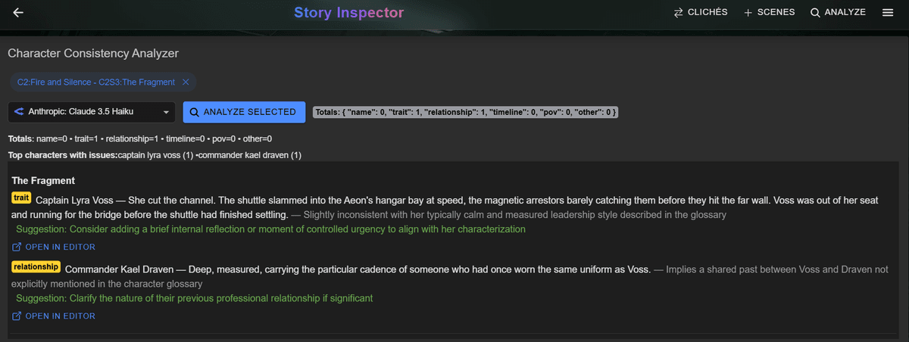

*Story analyzer checks character consistency across your entire manuscript.*

---

### Media & Story Analysis
*Generate illustrations, manage media, and analyze your manuscript for quality.*

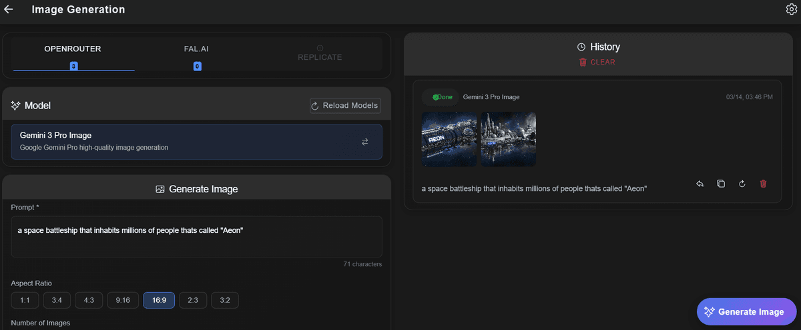

*Generate scene illustrations using AI image providers.*

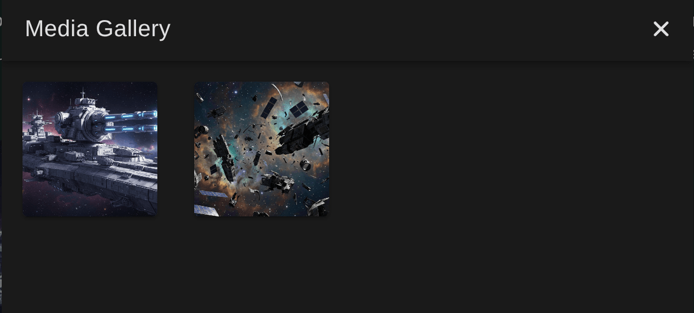

*Media gallery for organizing all images associated with your story.*

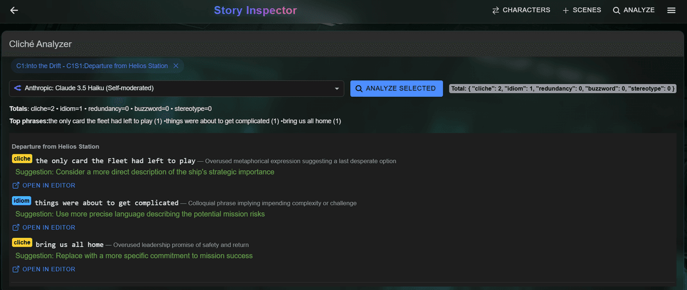

*Cliché detector identifies overused patterns and suggests alternatives.*

---

### Responsive Design
*Full-featured experience on mobile and tablet devices.*

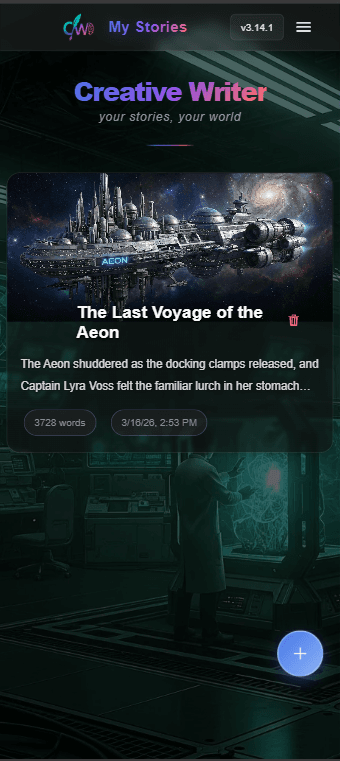

*Story list adapts cleanly to smaller screens.*

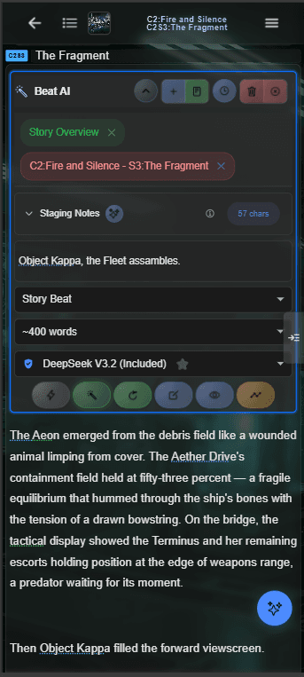

*The full editor experience works on mobile — write anywhere.*

---

## What This Repo Is For

This repository serves as the **community hub** for CreativeWriter. Here you can:

- **Report bugs** you encounter in the hosted or self-hosted edition
- **Request features** you'd like to see added
- **Join discussions** about creative writing workflows, AI integration, and the app's future

The application source code lives in separate repositories (hosted is private; self-hosted is source-available for personal use).

---

## Report a Bug / Request a Feature

Use the **Issues** tab to file structured reports:

- [**Report a Bug**](https://github.com/MarcoDroll/creativewriter-public/issues/new?template=bug_report.yml) — Something isn't working as expected
- [**Request a Feature**](https://github.com/MarcoDroll/creativewriter-public/issues/new?template=feature_request.yml) — Suggest an improvement or new capability

## Join the Discussion

Have a question, idea, or just want to chat? Head to the [**Discussions**](https://github.com/MarcoDroll/creativewriter-public/discussions) tab.

---

## Links

| | Link |
|---|------|
| **Hosted App** | [creativewriter.dev](https://creativewriter.dev) |
| **Self-Hosted Edition** | [creativewriter-selfhosted](https://github.com/MarcoDroll/creativewriter-selfhosted) |
| **Self-Hosted Docker Deployment** | [Deployment Guide](https://github.com/MarcoDroll/creativewriter-selfhosted#deployment) |

---

## Features

### Story Management
- **Multi-Story Support**: Manage multiple writing projects simultaneously
- **Rich Text Editor**: Full-featured ProseMirror-based editor with formatting tools and inline image support
- **Story Structure**: Organize your narrative with acts, chapters, scenes, and beats
- **Auto-Save**: Automatic saving with cross-device sync
- **Images Within Text**: Embed images directly within your story text for visual storytelling

### AI Integration
- **Multiple AI Providers**: OpenRouter, Google Gemini, Claude, OpenAI-compatible, and Ollama (local LLMs)
- **Image Generation**: Integration with Replicate and fal.ai
- **Real-time Streaming**: Live text generation with streaming responses
- **Beat AI Assistant**: Intelligent suggestions for plot development with version history
- **Scene Enhancement**: AI-powered scene expansion and refinement
- **Custom Prompts**: Fine-tune AI behavior with customizable prompt templates

### Codex System
- **Dynamic Knowledge Base**: Track characters, locations, and plot elements
- **Smart Context Awareness**: AI understands your story's universe
- **Relevance Scoring**: Intelligent filtering of relevant codex entries for each scene

### Data Management
- **Import/Export**: Support for various formats, compatible with NovelCrafter exports
- **PDF Export**: Generate formatted PDFs of your stories
- **Real-time Sync**: Cross-device synchronization (hosted edition)

### Customization
- **Theme Support**: Dark and light modes
- **Custom Backgrounds**: Upload and manage custom writing backgrounds
- **Flexible Layouts**: Adjustable editor and panel configurations
- **Font Options**: Multiple font choices for comfortable reading and writing

---

## License

This project is proprietary software — see the [LICENSE](LICENSE) file for details. For self-hosted deployment, see [creativewriter-selfhosted](https://github.com/MarcoDroll/creativewriter-selfhosted) (source-available, personal use only).

## Acknowledgments

- Built with [Angular](https://angular.dev/) and [Ionic](https://ionicframework.com/)
- Rich text editing powered by [ProseMirror](https://prosemirror.net/)
- Backend infrastructure by [Supabase](https://supabase.com/) and [Cloudflare](https://www.cloudflare.com/)
- AI integrations via OpenRouter, Google Gemini, Claude, and more
- Developed using AI-powered pair programming with [Claude Code](https://claude.ai/code)
